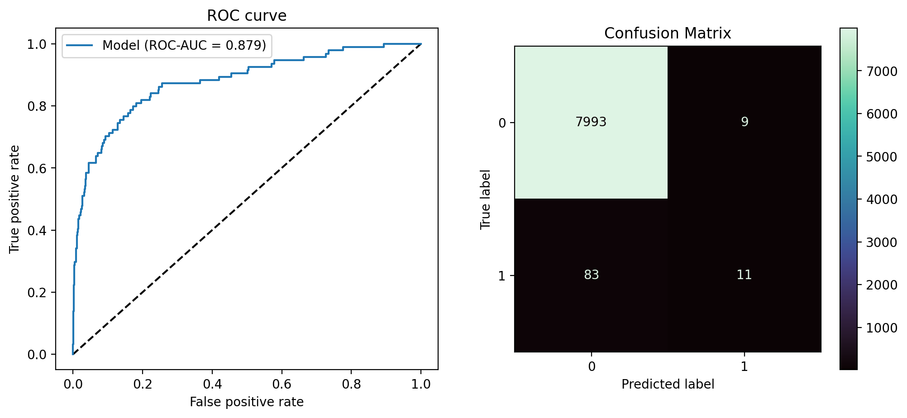
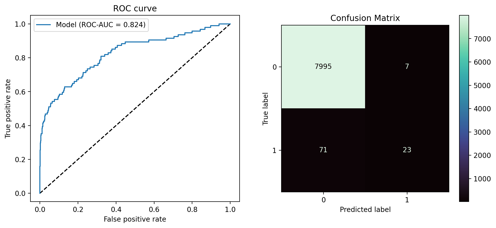
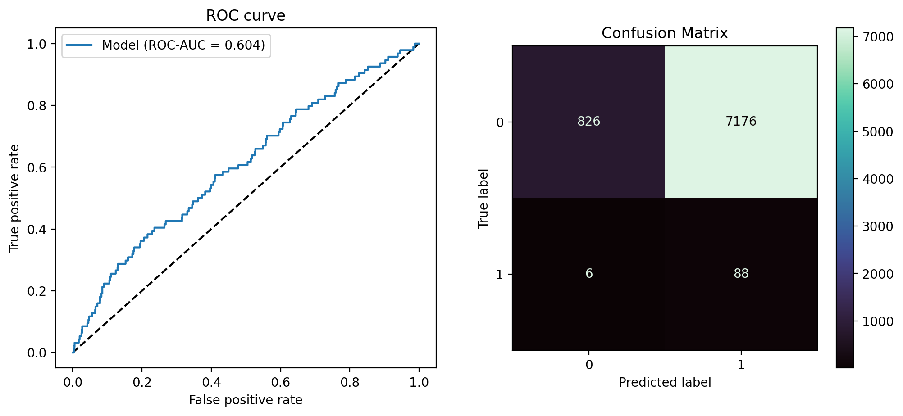

# ML4SCI_Deeplense_Gravitational_Lensing

## Project Overview
Detecting strong lensing from images of space have multiple scientific applications like studying mass profiles of distant galaxies and clusters,
studying properties of galaxies at very large distances. Detected images can also be used further in the DeepLense project pipeline.
In this project we tried to apply differnt algorithms to detect strong lensing.

## Slides
[Slides for the project](https://docs.google.com/presentation/d/1aa7NTgrcoE91EgPTR_jwwISQExvI0FZgCo83sSTcFxg/edit?usp=sharing)

## Data
We will be using two datasets, simulated and  real.
The real data is obtained from Hyper Suprime-Cam (HSC) Subaru Strategic Program Public Data Release 2.
In this the ratio of Non_lensed: lensed is (100 : 1),with total images being ~ 40k images.
The simulated data is made using lenstronomy code. 
Here the ratio of Non_lensed: lensed is almost (2 : 1),with total images being ~ 60k images.
20 % of the real dataset (94 are lensed 8000 are non lensed) are used for testing.

## How to use/Training
In the tutorial notebooks, its shown how we have trained the models. To know the exact hyperparameters, please 
check the utils.py file. Kaggle GPUs were used to train and experiment all the models.

## Files

|Files                   | Description                         |
|------------------------|-------------------------------------|
|Lensing_DomainAdaptation| Contains all the code used      |
|notebooks               | Tutoral & data exploration notebooks|
|plots                   |test metric plots |

## Results

### Best AUCROC score without Domain adaptation : 0.816 
Using simple classification with Efficientnet_b2 as pretrained model.

### Table showing AUCROC score for each Domain Adaptation technique(row) and the Encoder model used (column)

|                | Efficientnet_b2  | Resnet34  |  Densenet_121 |  ECNN  |
| -------------  | :---------------:  | :--------:  |  :------------: |  :-----: |
| ADDA           |        0.835     |   0.797   |     0.798     | `0.879`|
| Self-Ensembling|        0.604     |   0.445   |     0.537     |  0.449 |
| AdaMtch        |        0.824     |   0.8     |     0.763     |  0.795 |

#### ADDA

#### Adamatch

#### Self-ensembling

### [Model Weights](https://drive.google.com/file/d/1tWA5uCnyPV4UqL1a-t5qzvyNCtTtqz2z/view?usp=sharing)

             