# Physics-Informed Unsupervised Super-Resolution of Strong Lensing Images

Hey, I’m Anirudh Shankar. Through my Google Summer of Code (GSoC) 2024 project with Machine Learning for Science (ML4Sci) and DeepLense, I’ve integrated the Physics of Strong Gravitational Lensing to develop an unsupervised super-resolution architecture that upscales the quality of lensing images, without needing any high-resolution training data ! 

I've also drafted this README page as a blog post, that you can find [here](https://medium.com/@anirudhshankar99/physics-informed-unsupervised-super-resolution-of-lensing-images-gsoc-2024-x-ml4sci-51cedc1cfb00).

Find below the list of contents of this description:

1. [Replication and set-up](#1-replication-and-set-up)
2. [What is gravitational lensing ?](#2-what-is-gravitational-lensing-)
3. [Motivation](#3-motivation)
4. [Datasets](#4-datasets)
5. [Proposed architecture](#5-proposed-architecture)
6. [Performance and comments](#6-performance-and-comments)
7. [Auxiliary studies](#7-auxiliary-studies)
8. [Perspective](#8-perspective)
9. [Outreach](#9-outreach)
10. [References](#10-references)
11. [Appendix](#11-appendix)

## 1. Replication and set-up
The Git repository can be accessed from here, as part of the parent ML4Sci repository.

It contains all the Python Notebooks used in training and testing, the trained model weights, dataset simulation scripts, set-up instructions and some examples.

Requirements are divided into two, for each of the tasks:

**1. Image simulation**: Use the following in an environment of your choice to install the libraries required for simulating the datasets: 

`pip install simulations.txt` 

The Simulations directory contains the code used to create the dataset, and is adopted from [Michael Toomey’s work](https://github.com/mwt5345/DeepLenseSim/tree/main/Model_I), one of my project mentors.

**2. Super-resolution and related tasks (basically, everything else)**: Use the following in an environment of your choice to install the libraries required for everything else presented in this project:

`pip install requirements.txt`

## 2. What is gravitational lensing ?

Gravitational lensing is the phenomenon of the bending of light in the gravity of a massive celestial object (such as a massive galaxy or a group of galaxies); the object essentially behaving as a cosmic lens. We, as a result see the distorted image(s) of light sources (typically another galaxy) behind it. This, illustrated below, is taken from [1].

The gravitational lens distorts the source galaxy through a quantity called the deflection angle, that is directly related to the lens' mass distribution. The schematic below captures its essence, as required for the scope of this project.

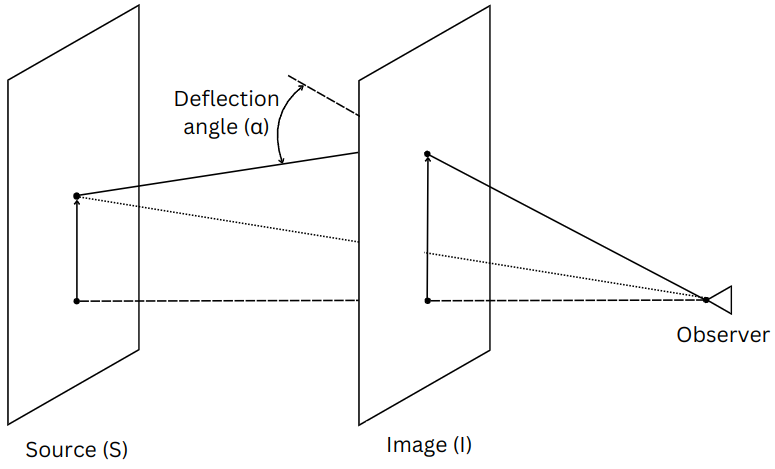

It's sufficient here to look at the phenomenon of lensing, as a transformation of the position of the source image intensities (more in the [Appendix](#11-appendix)).

### Dark matter sub-structure

Dark matter (DM) is a predicted form of matter that evades interaction with all electromagnetic radiation. Gravitational lenses in this project are defined by dark matter consisting of three types of sub-structures. It's presence is felt through the gravitational field it exerts in space. It's composition is suggested by different cosmological models, as follows:
1. **No sub-structure**: This model suggests that dark matter is devoid of sub-structure. 
2. **Axion DM (vortices)**: This model suggests that dark matter is comprised of particles called axions, that form vortex sub-structures in the axion fields.
3. **Cold DM (sub-halos)**: This model suggests that dark matter is comprised of cold, slow-moving particles that form structures called sub-halos.

The composition of DM in a lens can affect its properties, and a study relating to it is presented later in this article.

## 3. Motivation

Knowing the deflection angle that produced the lensing images can be used to accurately upscale 'reproduce' lensing in a noise-free and higher quality setting, from a suitable source representation.

$$\overrightarrow{I} = \overrightarrow{S} - \alpha$$ 

The idea is two-fold:
1. Extract the deflection angles produced by the lens from the lensing images using a learnable network.
2. Create upscaled images using the extracted deflection angle on a Sérsic profile, which serves as an approximation of the source image of the lensing system. 

The network functions on, and is limited by the network's ability to extract the deflection angles accurately, and the closeness of the source to a Sérsic profile.

The physics of gravitational lensing is imposed on the network through several physical constraints and loss functions, as described in [Section 5](#5-proposed-architecture).

Training is done on low-resolution lensing images alone, as described in the [following section](#4-datasets).

## 4. Datasets

Three datasets are used, each of which mimics a telescope:
* Model 1 dataset: mimics an artifically constructed telescope
* Model 2 dataset: mimics Euclid
* Model 3 dataset: mimics the Hubble Space Telescope

Each dataset contains 5000 low-resolution images, simulated with a lens modelled by one of the three DM sub-structures described in [Section 2](#2-what-is-gravitational-lensing-). A separate set of 5000 low-resolution images, and 5000 corresponding high-resolution images are used for evaluation. Note that the HR images aren't used in training whatsoever.

## 5. Proposed architecture

The designed super-resolution architecture incorporates the physics of gravitational lensing in various ways. The schematic is below:

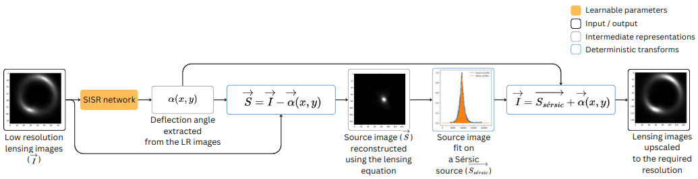

A single-image super-resolution convolutional neural network (SISR network or residual CNN henceforth) is used to extract the deflection angles produced by the lens, from the lensing images. The extracted deflection angle is used to reconstruct the source image, which is then fit on a [Sérsic profile](https://en.wikipedia.org/wiki/S%C3%A9rsic_profile). A Sérsic profile is a mathematical function that can be used to represent fairly closely a galaxy's light profile.

The Sérsic profile is then re-lensed with the deflection angle to produce the upscaled lensing images, at any required resolution. 

The model is trained in an unsupervised fashion using a multi-faceted physics-based loss module:
* Multi-scale loss: The multi-scale loss module is employed to ensure the preservation of structural quality across different length scales, through extraction of potent astrophysical information. To attain this, loss components defined subsequently, are imposed on these three resolution scales:
  * Low-resoltuion scale (1x): At the dimensions of the input lensing images
  * High-resolution scale (2x): At the dimensions of the target super-resolution images
  * Sub-low-resolution scale (0.5x): At dimensions that are further lower than the low-resolution input images
* Mean squared error (MSE) between the Sérsic profile and the reconstructed source image
* MSE between the interpolated images and the images produced by the model
* Intensity constraints between the Sérsic source and the upscaled lensing images. This is elabored on in the [Appendix](#11-appendix)
* The deflection angle is ensured to be > 0, as this is a physical constraint on the system owing to the non-negativity of the mass distribution
* A variation density loss (VDL) that restricts the local variability of the deflection angle. This loss ensures that the produced deflection angles remain physical, and without any artifacts or aphysical fluctuations. More in the [Appendix](#11-appendix).

Models are trained on the training dataset described in [Section 4](#4-datasets), with a 80:20 validation split. They're later tested on the testing dataset, as described there. Here are a few examples of the results:

| Model 1 |
| :---: |
|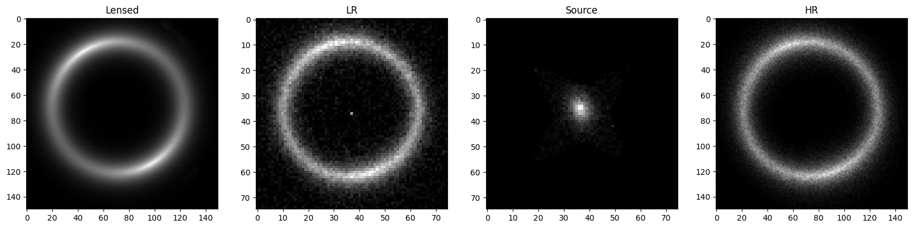|

| Model 2 |
| :---: |
||

| Model 3 |
| :---: |
|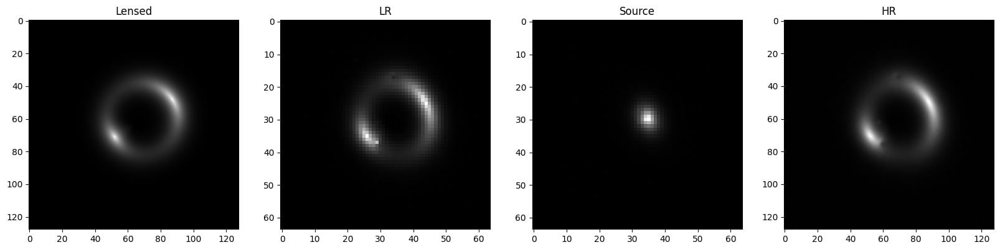|

## 6. Performance and comments

Performance of the models are evaluated using the following metrics:
* **MSE**: The MSE between the SR and true HR images acts as a simple estimate of closeness of individual pixels in both images.
* **Structural Similarity Index Measure (SSIM)**: This metric also evalutates how different the relation between pixels and their neighbours are, in the SR and true HR images.
* **Peak Signal-to-Noise Ratio (PSNR)**: This metric acts as a measure of the amount of noise present in the image. A higher value corresponds to better image quality (lesser noise).

Model 1:
|  Sub-structure  |   MSE    |  SSIM |  PSNR  |
|-----------------|----------|-------|--------|
| No_substructure | 0.003310 | 0.718 | 25.255 |
|  Axion (vortex) | 0.004801 | 0.660 | 23.506 |
| CDM (sub-halos) | 0.004923 | 0.659 | 23.491 |

Model 2:
|  Sub-structure  |   MSE    |  SSIM |  PSNR  |
|-----------------|----------|-------|--------|
| No_substructure | 0.004661 | 0.214 | 23.785 |
|  Axion (vortex) | 0.004555 | 0.215 | 24.064 |
| CDM (sub-halos) | 0.004741 | 0.212 | 23.768 |

Model 3:
|  Sub-structure  |   MSE    |  SSIM |  PSNR  |
|-----------------|----------|-------|--------|
| No_substructure | 0.001487 | 0.819 | 29.167 |
|  Axion (vortex) | 0.001715 | 0.808 | 28.578 |
| CDM (sub-halos) | 0.001684 | 0.809 | 28.636 |

### Performance on the model-2 dataset
As seen above, the performance of the model on the model-2 dataset (limited to the SSIM) appears to be significantly worse. Model-2, mimicing Euclid, has a much lower PSF (point spread function) when compared to the other models. This causes broader and more blurred local features in the images, with which both the model. The worse performance can thus be associated for the most part with the quality issues imposed by the model-2 PSF.

## 7. Auxiliary studies

The following auxiliary studies were performed to test some limits of the model:

### Model sophistication

This direction tests the hypothesis that suggests that model sophistication could bring better model performance. Three highly sophisticated architectures are tested against the residual CNN from [Section 6](#6-performance-and-comments). Their descriptions follow:
* **Residual CNN**: benchmark, ∼0.9 M trainable parameters
* **(compact) Residual Channel Attention Networks (RCAN)**:
Contains both inter-channel and pixel attention mechanisms; ∼2.3 M
trainable parameters
* **Super-resolution GAN (SRGAN)**:
Constructed with three discriminator networks, one for each image
scale (that’s used in the multi-scale loss during training), and a
super-resolution generator; ∼1.21 M trainable parameters
* **SRGAN with a feature extractor**:
A truncated pre-trained classifier maps the images to a low
dimensional latent space, acting as a feature extractor. The
perceptual loss is then calculated using the MSE between extracted
features of the images, instead of the images themselves. ∼1.21 M
trainable parameters + ∼0.4 M of the feature extractor

Now you can find below their relative performance metric results, compared to the residual CNN's baseline. The complete list of scores are present in the [Appendix](#11-appendix).

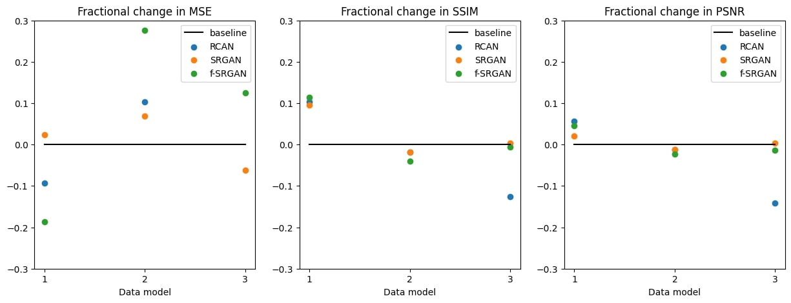

It's seen that across all the sophisticated models, there is at most a 10% improvement in the SSIM and PSNR metrics. This could imply some minute structural improvements, the models perform similarly on the grand scale.

This result falls in line with several studies that suggest that PINNs can be used with less sophisticated models to achieve similar performance.

### Data sparsity

This direction tests the performance of the model when trained with a much smaller dataset (20% images for training). The relative performance metric results follow, as compared to the residual CNN's baseline, with the complete list of scores in the [Appendix](#11-appendix).:

The model trained on fewer samples again, show at most a 10% degradation in the SSIM and PSNR scores. Again, this could imply minute structural improvements, but overall similariy in performance.

This result also falls in line with several PINN studies, suggesting that a strength of PINNs is their ability to function effectively with sparse datasets.

### Quality verification

This final direction aims at ensuring the quality of images produed by the SR architecture proposed. While the SSIM and PSNR scores can ensure perceptual quality, their true quality that one can see directly, must also be ensured.

For this purpose, a downstream classification into the three DM sub-structure classes is performed by similar classification networks on the two sets of images: the LR images, and the SR architecture's outputs. There was initially a 10% worse perofrmance by the SR model in downsteam classification accuracy, and small adjustments to the architecture was made to preserve SR image quality.

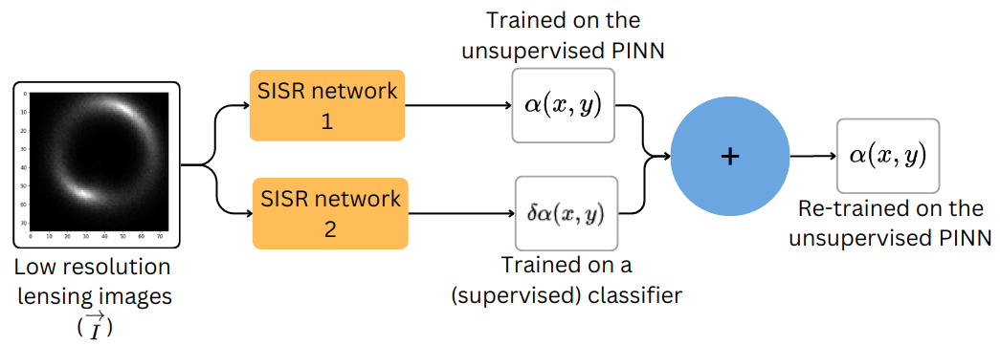

Two residual CNNs are are used to extract two components of the deflection angle. The first is trained on the unsupervised SR architecture described in [Section 5](#5-proposed-architecture), while the second is trained on a classifier. The two are combined, and then re-trained on the unsupervised SR architecture to ensure physical soundness.

The downstream classification accuracies and thus, the true quality of images by extension are much better: 

Model 1:
| Performance with LR | Performance with SR model |
| :---: | :---: |
| 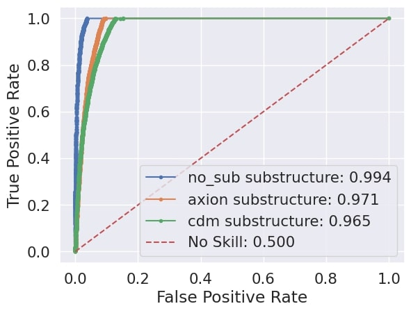 | 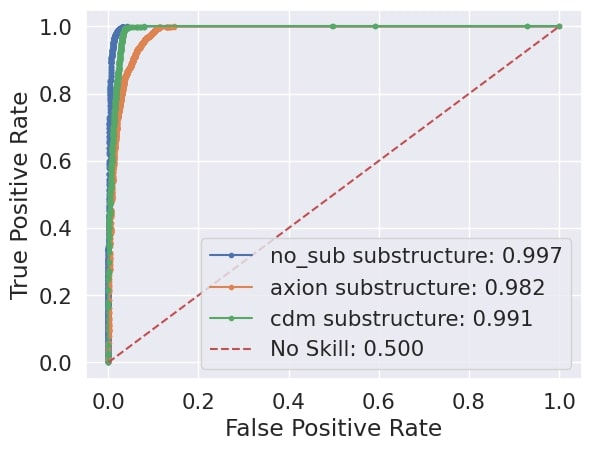 |

Model 2:
| Performance with LR | Performance with SR model |
| :---: | :---: |
| 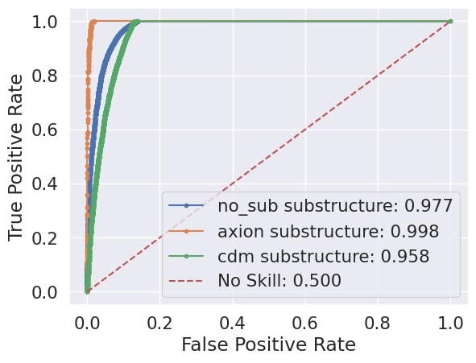 |  |

Model 3:
| Performance with LR | Performance with SR model |
| :---: | :---: |
| 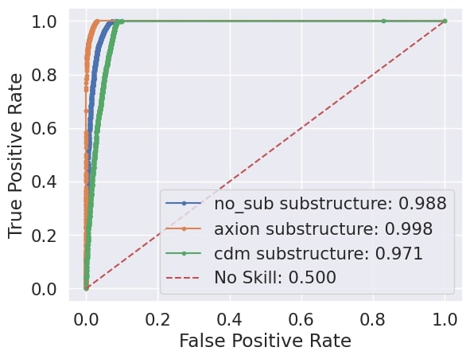 |  |

It's seen that the SR model outputs outperform the LR images in downstream classification accuracy, illustrating the model's ability to capture better the characteristics of the lensing images, as demonstrated by the better AUC scores.

## 8. Perspective

Below are some ways of further pushing this project:

* Extract mass distributions instead of deflection angles: this will allow direct study of the lens models behind the images and can benefit from more constraints, perhaps using equivariant networks
* Test the model's limits with higher target upscaling (3x, 4x, 5x)
* Test the model's limits with noisier/lower resolution images as inputs

## 9. Outreach

A short paper based on the project will be presented as a poster at the
[38th annual conference on Neural Information Processing Systems](https://ml4physicalsciences.github.io/2024/)
(NeurIPS), on the 15th of December.

## 10. References

1. Scott Dodelson and Fabian Schmidt. Modern Cosmology. Elsevier, 2021.

## 11. Appendix

### 11.1. Re-lensing

The action of lensing, as described [above](#2-what-is-gravitational-lensing-), can be viewed as a transformation of intensity positions:
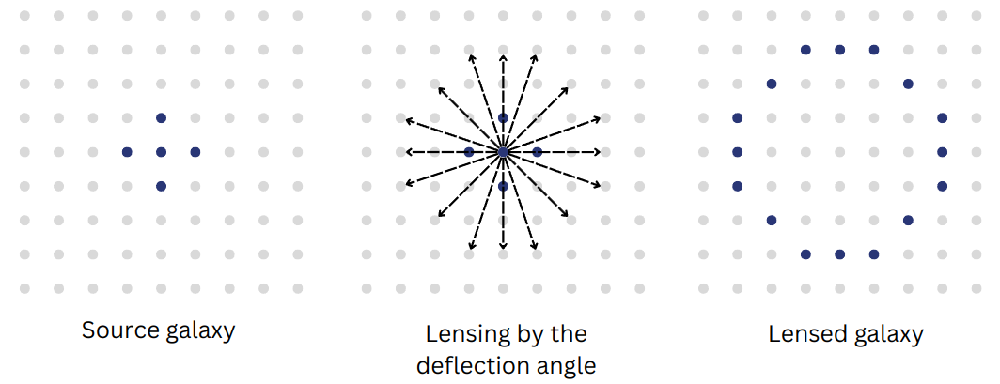

Here's an example of what that looks like:

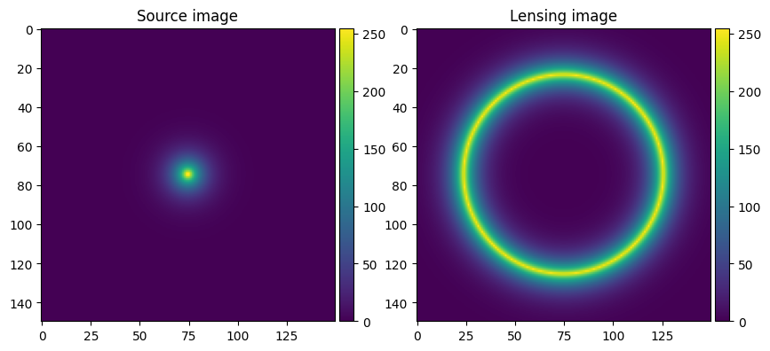

Here's what it looks like when the source image doesn't fall in line with the lensing plane, i.e, the source isn't in the center of the image

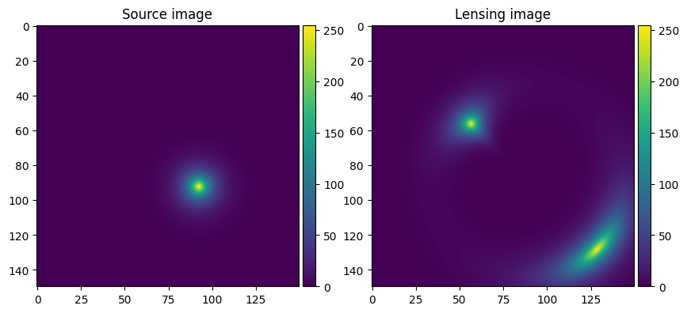

### 11.2. Fitting Sérsic

The source image is produced from the lensing image using the deflection angle. To preserve gradients, [PyTorch](https://pytorch.org/docs/stable/index.html)'s [grid_sample](https://pytorch.org/docs/stable/generated/torch.nn.functional.grid_sample.html) functionality is used; as the [scatter_](https://pytorch.org/docs/stable/generated/torch.Tensor.scatter_.html) and [index_select_](https://pytorch.org/docs/stable/generated/torch.index_select.html) functionalities that are also index transformations do not preserve gradients being in-place operations, and the preservation of gradients is essential in the physics-based training.

Once produced, the parameters of the Sérsic profile are to be obtained from the source reconstruction. In this project, the only parameters that are fit, are the position coordinates of the source. A deterministic approach is used to obtain the same, following the location of the maximum intensity pixel in the source reconstruction, and using it's coordinates as the Sérsic center. The necessary conversions however have to be made from the pixel space to the arcsecong space. Here's an example:
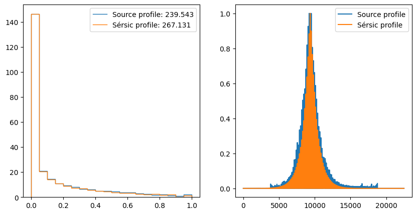

### 11.3. VDL

The variation density loss (VDL) is a special constraint used to ensure the smoothness of the extracted deflection angle. It's defined as the sum of the difference between adjescent pixels in both directions, normalized by the number of pixels in the image:
$$VDL(\alpha(x,y)) = \frac{\sum_y \sum_{i=0}^{n-1} (\alpha(i\delta x,y) - \alpha((i+1)\delta x, y)) + \sum_x \sum_{i=0}^{n-1} (\alpha(x,i\delta y) - \alpha(x,(i+1)\delta y))}{n^2}$$

It's used to prevent the occurances of high-valued artifacts, and to keep the deflection angle physical. Below is an example without the use of the VDL:

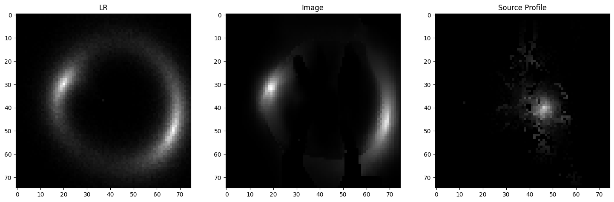

While the model is able to extract the some information about the deflection angle, it's not nearly enough for an accurate representation. It additionally suffers from gaps and artifacts. Here's an example (of a different image) with the use of the VDL: 

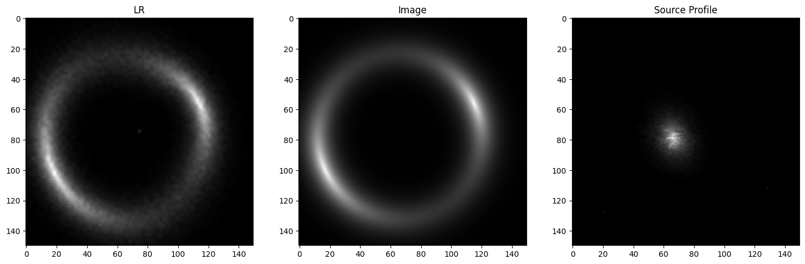

The produced image is much smoother.

The weight of the VDL must be chosen carefully. A value that's too small can result in insufficient constriction, and one that's too large can result in incorrect deflection angles. An effective approach to select the appropriate value is to use a decaying VDL with an epoch-wise analysis for convergence, followed by fine-tuning.

### 11.4. Tangential alpha

The different networks extract the deflection angle $\alpha(x,y)$ as its two components, $\alpha_r(x,y)$ and $\alpha_t(x,y)$, the radial and tangential components respectively. While the radial component alone is capable of representing the deflection angle almost exactly, the tangential component is included here to potentially correct inaccuracies presented during the interconversions between the continuous arcsecond space and the discrete pixel space.

### 11.5. Conservation laws/constraints

The lensing system's physical constraints are hard-imposed in the physics-based architecture. They are:
* Intensity conservation between the source and image, $I(\theta) = I^s(\beta(\theta))$
* Positivity of the deflection angle, $\alpha(x,y) > 0$
 This constraint is derived from the the origin of the deflection angle: the lensing potential $\psi$. The _surface mass density_ $\kappa(\theta)$ ensures that $\alpha(\theta)$ > 0, as $\kappa(\theta) > 0$
$$\phi (\theta) = \frac{1}{\pi}\int_{\mathbb{R}}\text{d}^2\theta'\kappa(\theta')\text{ln}|\theta-\theta'|$$
$$\alpha(\theta) = \nabla\psi$$

### 11.6. Performance metrics of sophistication analysis

**RCAN:**

Model 1:
|  Sub-structure  |   MSE    |  SSIM |  PSNR  |
|-----------------|----------|-------|--------|
| No_substructure | 0.003756 | 0.759 | 25.607 |
|  Axion (vortex) | 0.003854 | 0.749 | 25.466 |
| CDM (sub-halos) | 0.004006 | 0.740 | 25.215 |

Model 2:
|  Sub-structure  |   MSE    |  SSIM |  PSNR  |
|-----------------|----------|-------|--------|
| No_substructure | 0.003104 | 0.219 | 25.353 |
|  Axion (vortex) | 0.003159 | 0.216 | 25.299 |
| CDM (sub-halos) | 0.003231 | 0.216 | 25.191 |

Model 3:
|  Sub-structure  |   MSE    |  SSIM |  PSNR  |
|-----------------|----------|-------|--------|
| No_substructure | 0.003976 | 0.717 | 24.792 |
|  Axion (vortex) | 0.003932 | 0.708 | 24.832 |
| CDM (sub-halos) | 0.004084 | 0.706 | 24.608 |

**GAN:**

Model1:
|  Sub-structure  |   MSE    |  SSIM |  PSNR  |
|-----------------|----------|-------|--------|
| No_substructure | 0.004767 | 0.743 | 24.284 |
|  Axion (vortex) | 0.004097 | 0.750 | 24.854 |
| CDM (sub-halos) | 0.004385 | 0.740 | 24.556 |

Model 2:
|  Sub-structure  |   MSE    |  SSIM |  PSNR  |
|-----------------|----------|-------|--------|
| No_substructure | 0.003104 | 0.219 | 25.353 |
|  Axion (vortex) | 0.003159 | 0.216 | 25.299 |
| CDM (sub-halos) | 0.003231 | 0.216 | 25.191 |

Model 3:
|  Sub-structure  |   MSE    |  SSIM |  PSNR  |
|-----------------|----------|-------|--------|
| No_substructure | 0.001479 | 0.821 | 29.163 |
|  Axion (vortex) | 0.001609 | 0.812 | 28.818 |
| CDM (sub-halos) | 0.001631 | 0.811 | 28.742 |

**feature-GAN:**

Model 1:
|  Sub-structure  |   MSE    |  SSIM |  PSNR  |
|-----------------|----------|-------|--------|
| No_substructure | 0.004442 | 0.745 | 24.305 |
|  Axion (vortex) | 0.002908 | 0.770 | 25.902 |
| CDM (sub-halos) | 0.003376 | 0.756 | 25.310 |

Model 2:
|  Sub-structure  |   MSE    |  SSIM |  PSNR  |
|-----------------|----------|-------|--------|
| No_substructure | 0.003510 | 0.213 | 25.108 |
|  Axion (vortex) | 0.003573 | 0.212 | 24.882 |
| CDM (sub-halos) | 0.003649 | 0.210 | 24.942 |

Model 3:
|  Sub-structure  |   MSE    |  SSIM |  PSNR  |
|-----------------|----------|-------|--------|
| No_substructure | 0.001425 | 0.819 | 29.343 |
|  Axion (vortex) | 0.002304 | 0.796 | 27.311 |
| CDM (sub-halos) | 0.001682 | 0.807 | 28.550 |

### 11.7. Performance metrics of sparsity analysis

Model 1:

|  Sub-structure  |   MSE    |  SSIM |  PSNR  |
|-----------------|----------|-------|--------|
| No_substructure | 0.003353 | 0.762 | 25.390 |
|  Axion (vortex) | 0.002968 | 0.763 | 25.763 |
| CDM (sub-halos) | 0.003188 | 0.755 | 25.519 |

Model 2:

|  Sub-structure  |   MSE    |  SSIM |  PSNR  |
|-----------------|----------|-------|--------|
| No_substructure | 0.005071 | 0.211 | 23.459 |
|  Axion (vortex) | 0.004829 | 0.214 | 23.814 |
| CDM (sub-halos) | 0.005044 | 0.211 | 23.519 |

Model 3:

|  Sub-structure  |   MSE    |  SSIM |  PSNR  |
|-----------------|----------|-------|--------|
| No_substructure | 0.004156 | 0.786 | 25.519 |
|  Axion (vortex) | 0.003884 | 0.790 | 26.537 |
| CDM (sub-halos) | 0.003883 | 0.786 | 25.986 |