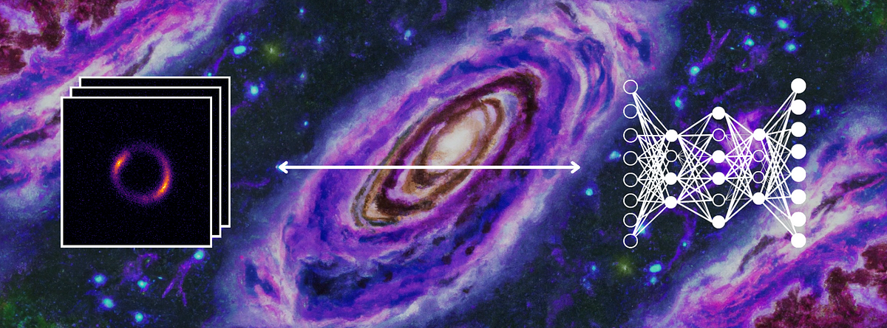
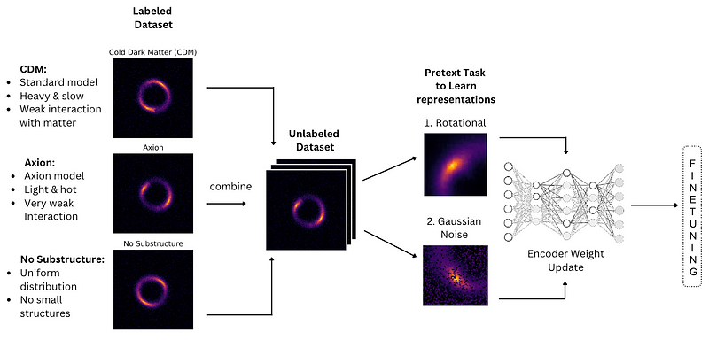
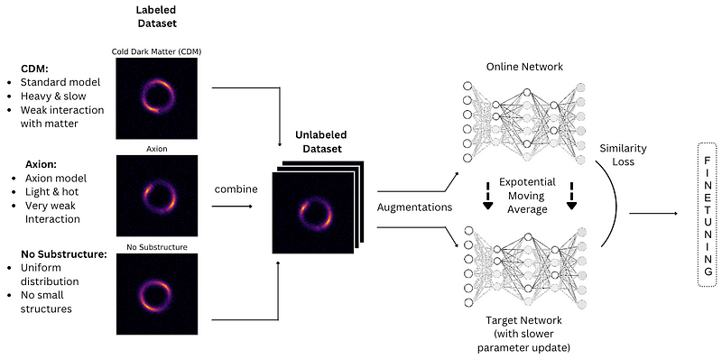

# Self-Supervised Learning for Strong Gravitational Lensing  :sparkles: :milky_way:
*Special thanks to (mentors) Anna Parul, Yurii Halychanskyi, and Sergei Gleyzer.*

 

Click on this button below to read the detailed blog:    

Code is written in:  

## Contrastive Learning

Contrastive learning is a type of self-supervised learning method, that tries to learn similar and dissimilar representations of data by contrasting positive and negative examples.

## Bootstrap Your Own Latent (BYOL) Learning

BYOL trains two networks, the target network and the online network, both in parallel. There are no positive or negative pairs here like there are in contrastive learning. Two different augmented views of the ‘same’ image are brought, and representations are learned using the online network, while the target network is a moving average of the online network, giving it a slower parameter update.

## Classification Results
The values in the Model columns represent AUC for axion, cdm and no_sub respectively.
e.g (0.97, 0.96, 1.0) represents 0.97 AUC for axion, 0.96 AUC for cdm and 1.0 AUC for no_sub.

All results were calculated on a **separate test set**.

|            NN Architecture            |    Model I     |  Model II   |  Model III   | 
| :-----------------------------------: | :------------: | :---------: | :----------: | 
|   Baseline ResNet50      | 0.97, 0.96, 1.0 |   0.98, 0.92, 0.98   |    0.96,0.95,0.99    |   
|  Contrastive Learning Rotation Pretext | 0.92, 0.91, 1.0 |**0.99, 0.99, 1.0** | **1.0, 0.99, 1.0** |   
|Contrastive Learning Gaussian Noise Pretext| 0.96,0.95,1.0   | **0.99, 0.99, 1.0**     |   **1.0, 0.99, 1.0**    | 
| Bootstrap Your Own Latent | 0.95, 0.93, 1.0 |    **1.0, 0.98, 1.0**  |   0.98, 0.92, 0.98   | 

## Regression
The goal here is to explore the properties of dark matter. We want to approximate the mass density of the vortex substructure of dark matter condensates on simulated strong lensing images. For this, I used the above two methods, contrastive learning and BYOL to capture representations present in the axion image, which could be beneficial for our regression task. A log10 transformation is required to make the distribution more normal-like and handle high-level outliers. Then the transform is removed after prediction. Here, the results clearly show that SSL performs better than standard baseline supervised regression:

## Conclusion and Future Goals
So far, we can see that the results for self-supervised learning seem superior to their ResNet50 Baseline. 
Future goals consist of testing models for regression, implementing vision transformers (twin networks) and testing some more self-supervised learning methods.
