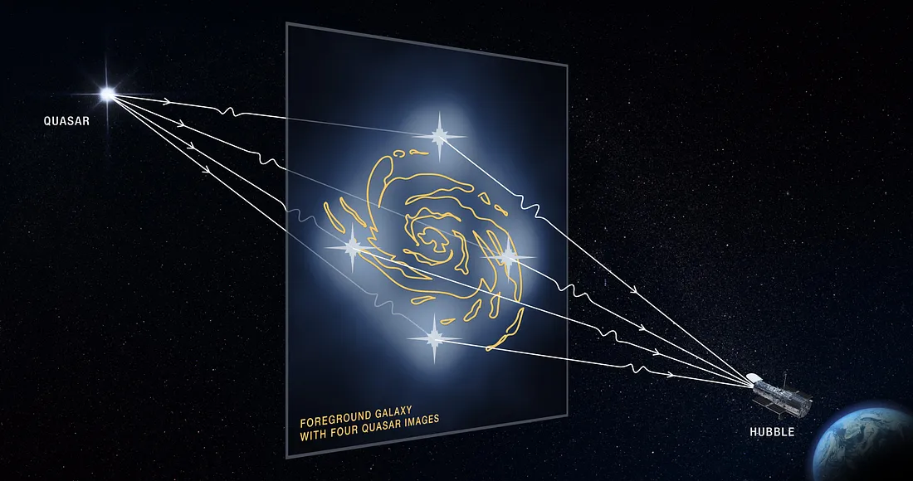
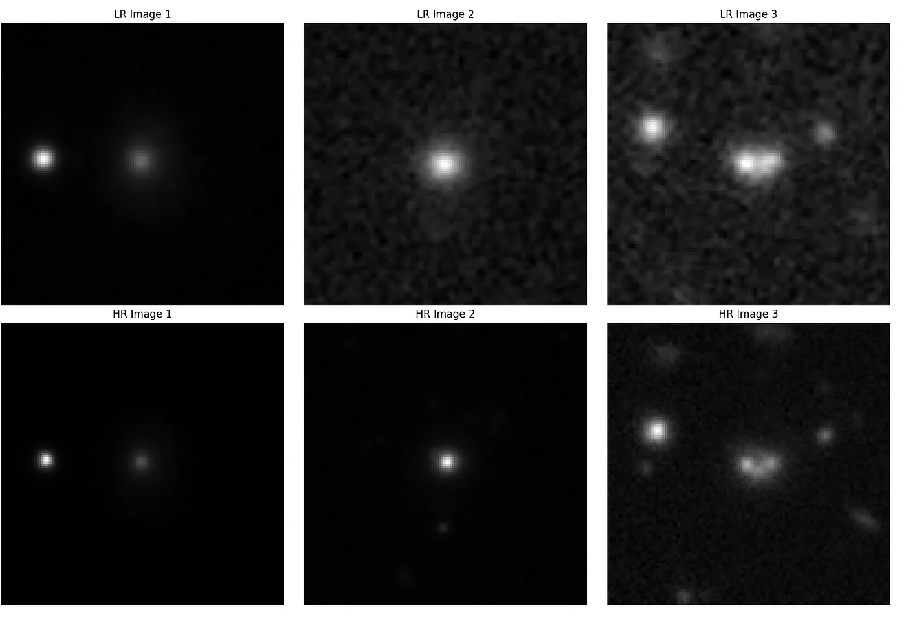

# Single Image Super-Resolution with Diffusion Models

This project focuses on enhancing the resolution of gravitational lensing images using diffusion models. The goal is to improve the clarity and detail of these images, aiding in better scientific analysis and discoveries.

## Project Overview

### Gravitational Lensing

Gravitational lensing is a phenomenon predicted by Einstein's theory of general relativity. It occurs when a massive object, like a galaxy cluster or black hole, bends the path of light from a distant source. This can create multiple images, arcs, or rings of the source, depending on the alignment and mass distribution of the lensing object.



*[Image Source](https://www.jpl.nasa.gov/images/pia23641-gravitational-lensing-graphic)*


### Importance of Super-Resolution

Enhancing the resolution of gravitational lensing images is crucial for:

- **Improved Accuracy:** Clearer images allow for more precise measurements of lensing effects, leading to better estimates of the mass and distribution of dark matter.
- **Detecting Faint Sources:** Higher resolution reveals faint, distant galaxies that are magnified by the lensing effect but obscured in lower-quality images.
- **Studying Cosmic Structure:** Enhanced images provide better insights into the structure and evolution of galaxies and galaxy clusters.

## Dataset

The dataset consists of 2,834 pairs of Low Resolution (LR) and High Resolution (HR) images. The LR images are derived from the HR images by adding Gaussian noise and applying blurring.



## Results

| Model   | PSNR  | SSIM  | Paper |
|---------|-------|-------|-------|
| [DDPM](https://arxiv.org/abs/2006.11239)    | 26.95 | 0.821 | [Link](https://arxiv.org/abs/2006.11239) |
| [SR3](https://arxiv.org/abs/2104.07636)     | 28.81 | 0.854 | [Link](https://arxiv.org/abs/2104.07636) |
| [SRDiff](https://arxiv.org/abs/2104.14951)  | 34.71 | 0.87  | [Link](https://arxiv.org/abs/2104.14951) |
| [ResShift](https://arxiv.org/abs/2201.11745)| 35.55 | 0.879 | [Link](https://arxiv.org/abs/2201.11745) |
| [CG-DPM](https://arxiv.org/abs/2106.07579)  | 33.447| 0.851 | [Link](https://arxiv.org/abs/2106.07579) |

*Results on the Test Dataset*

## Future Work

- Exploring Score-Based Conditional Diffusion Models.
- Investigating Diffusion GANs.
- Exploring various loss techniques.
- Investigating the best techniques with a residual prediction approach.

## Installation

1. **Clone the repository:**

   ```sh
   git clone https://github.com/yourusername/your-repo-name.git
   cd your-repo-name
