# Physics-informed unsupervised super-resolution of lensing images: GSoC 2025 mid-term
Hey, I'm Anirudh Shankar. This article reports on the Google Summer of Code (GSoC) project in collaboration with Machine Learning for Science (ML4Sci), at it's half-way point. I've been working on ways to use the Physics of strong gravitational lensing to constrain the unsupervised super-resolution of lensed gravitational images.
This article will guide you through the motivation, and implementation of the architecture. Below is a list of its contents:
1. Code and data access
2. What is gravitational lensing?
3. Motivation and deliverables achieved
4. Implementation
5. Results
6. Perspectives
7. References
8. Appendix, for some stories on obstacles and how they were overcome
## 1. Code and data access
The Git repository can be accessed from here, in the parent ML4Sci repository.
It contains all the Python Notebooks used in training, the trained model weights, dataset simulation scripts, set-up instructions and some examples.
Use the following to install the required libraries in a virtual environment of choice

`pip install -r requirements.txt`

Do find the implementation in Section 4 if you want to skip to it.

Observed galaxy images of the [Galaxy10 DECaLS Dataset](https://astronn.readthedocs.io/en/latest/galaxy10.html) are used in the analyses of this work.

## 2. What is gravitational lensing?
The phenomenon of gravitational lensing was predicted by Einstein's general theory of relativity. The path of light curves due to the curvature of spacetime, often caused by the presence of massive (groupes of) objects in the line-of-sight between the the distorted source and the observer.

Lensing graphic, taken from Scott Dodelson and Fabian Schmidt.
Modern Cosmology. Elsevier, 2021.

The dynamics of the lensing process and the characteristics of the observed image both depend on the intensity distribution of the source, the spacetime curvature given by the mass distribution producing it (the lens), the distances and line-of-sight displacements between the source, the lens and the observer, and sometimes, the presence of interstellar media. 
We restrict our study to the phenomenon of **strong lensing**, where the source, the lens and the observer are nearly perfectly aligned along their mutual axis, and the lens is sufficiently massive. This produces directly observable features such as multiple images of Einstein rings and elongated arcs. 
An approximation we then make to simplify the study of the system is to say that almost all of the lens mass can be assumed to be concentrated at a single point, the **thin-lens approximation**. This allows for the study of lensing through the principles of Optics.

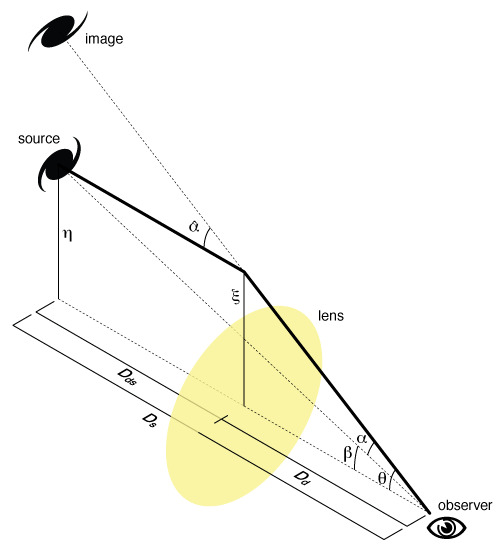
Lensing diagram, taken from Wikipedia

The positions of intensities of the source β are translated to produce the intensity positions of the observed image θ through a quantity called the deflection angle α, given by the lensing equation
$$\overrightarrow{\beta}=\overrightarrow{\theta}-\overrightarrow{\theta}(\overrightarrow{\alpha})$$

With these concepts in mind, we can proceed to the project.
## 3. Motivation
The studying of gravitational lensing can be very effective in probing the sub-structure of dark matter composing the lens. This requires images of high quality for a faithful study, which are often scarce. While super-resolution techniques exist, they traditionally require low-high resolution image pairs that are near impossible to obtain for the same source at the same conditions. The goal of this project is to use the physics of strong gravitational lensing to direct the unsupervised super-resolution of observed images, which in theory should outperform traditional unsupervised super-resolution, as a result of being informed by the physics.

### Handling degeneracies
We fix the lens model and conduct a posterior study of lensing. This is because the lensing system is degenerate, as we only have one of the two unknowns in the lensing equation, the observed image. Another way of saying this is that for a particular observed image, there can be many possible lens and source combinations that produce it. Another complication is that in reality, a single source is often lensed multiple times by different lenses to give multiple sets of images. Assuming the lens model thus eliminates both these degeneracies, at the cost of the unfaithful reconstruction of the source. While this could be handled to an extent through source specific deflection angle constructions, we skip this step as it is not essential for our task of super-resolution, and leave it for a future perspective. For all images, a single isothermal sphere lens model $\psi$ producing a uniform radial deflection is assumed, i.e., $\psi(\overrightarrow{r})=\theta_E$.

### Formulation of the task
For a deflection angle field $\alpha(\theta)$, a PSF P in the image plane mapped by the coordinates $\theta(x,y)$, we can perform lensing to obtain the coordinates in the source plane in rectangular coordinates that are axi-symmetric with the pixel grid of the images. $$\beta(x,y) = \theta(x,y) - \alpha_\psi(x,y)$$
For an observed image $i$, we can thus reconstruct the source $s$ by sampling $\circ$ the intensities in $i$ to positions $\beta(x,y)$.

$$s=i\circ \beta$$

If we have the corresponding high-resolution source image $\hat{s}$, we can re-lens it to the high-resolution counterpart of the observed image, $\hat{i}$, which is what we need. 

$$\hat{i}=\hat{s}\circ\theta$$ 

The idea is to train a neural network $f_\theta$ with the set of trainable parameters $\phi$ that performs this mapping from the low resolution reconstructed source to its high-resolution version, 

$$\hat{s}=f_\phi(s)$$

We can then define the forward differentiable operator for the neural network with the downsampling operation $D$ that maps an image to its lower-resolution counterpart, $D(P*\hat{i}=\hat{i}')$ as

$$F_\psi(i)=D(P*(f_\phi(i\circ\beta)\circ\theta))=\hat{i}'$$

The network can thus be trained in the promised unsupervised fashion to minimise the following loss function, for a set of observed images $y$:

$$L(\phi)=||F_\psi(y)-y||^2_{\sum^{-1}}+\lambda_{V}V(f_\psi(y))$$

* $V$ is a function that computes the total variation between pixels, and it is used in combination with its weight $\lambda_V$ to penalise the occurance of sharp peaks or artefacts in the learned high-resolution source image. It is to note that this is a non-physical prior to stabilise convergence.
* $||\cdot||^2_{\sum^{-1}}$ refers to the noise-weighted MSE, i.e., the chi-squared loss $\sum_i\frac{y_i-y_{model,i}}{\sigma_i^2}$, using the pixel-wise variance map if available. This can in addition be weighted by two terms-
    - A convergence mask $C(\beta)$ on to account for which pixels are actually constructed by the lensing operation, in order to prevent $f_\phi$ to hallucinate pixel values for pixels whose information does not exist. This mask can be constructed by $J\circ\beta$ where $J$ is the matrix of ones in the dimensions of the grid.
    - A magnification map $\mu(\theta)=1/\text{det}(I-\nabla\alpha)$ to prioritise the training more toward those pixels that are more maginfied.

Let us now look at how this is implemented.
## 4. Implementation
Below is a schematic of the unsupervised super-resolution pipeline discussed above.

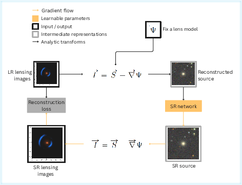
Schematic of the proposed pipeline

The following sections presents the work done so far, which is to experiment with different machine learning algorithms to tackle different parts of the pipeline, which then served as the mid-term goal.
## 5. Results
The pipeline can be divided into two rough halves-
* The construction of the high-resolution source
* The transformation of coordinates through the lensing equation

These tasks were attempted in the different ways, as follow:
### Analytic source reconstruction

Sérsic profiles (or their combinations) can be used to model fairly well the intensity distributions of certain types of galaxies. If they are able to closely model the sources, one would then have an analytic expression for them, which of course is not limited by resolution. The goal was then to try different optimisation algorithms to find the parameters of the Sérsics that best model the sources. For this purpose, some galaxy images were selected for testing performance.

**1. Policy optimisation**

Policy optimisation is a reinforcement learning algorithm that involves training a network to appxorimate the optimal policy to solve a problem, i.e., the set of actions at every state of the environment that maximise the total reward. The problem was framed as follows:
* States - Pixel-wise difference between the currently constructed image and the target image
* Actions - State specific parameters (sampled from a continuous space, see Appendix) of the next Sérsic to be added to the family of existing Sérsics that construct the image
* Reward - MSE between the constructed image and the target image
* The specific policy optimisation algorithm was PPO (proximal policy optimisation)

The network is then trained to maximise the reward by choosing actions. Reconstructions were seen to have significantly high error mean pixel percentages (>20%). This can be attributed to two factors-
1. Exploration of the policy is done through stochastic sampling from the choice of actions decided by the probabilities given by the policy. For a finite choice of actions, exploring the entire search space also achievable, which is no longer true for continuous spaces, as in our case. 
2. Regression isn't directly performed. The optimisation of hyperparameters is done through a complex loss maximises the overall policy. The gradient signal can be lost in exploration noise, especially when compared to direct optimisation techniques.
3. The galaxies contain featues like spiral arms that cannot be modelled by Sérsics.

As a result, the following direct parameter optimisation approach was attempted.

**2. Deep CNNs**

Convinced that a direct parameter optimisation approach was more suited to our particular task of acquiring the optimal set of Sérsic parameters to approximate a galaxy's intensity profile, a deep CNN was used in its place whose hidden space mapped the same States to the actions directly (i.e., no sampling from probability distributions). Following are the results following number of Sérsics added-

As seen, the mean pixel error percentages drop to below 10%, but this still not sufficient. In any case, a theoretical performance cap can be identified linked to the inability of Sérsics to model fine galaxy structure. This leaves us with two options, to either move toward learned representations of the source with finite resolutions instead of the analytic models, or to restrict ourselves to very smooth sources. We chose the former, as we believe that the error owing to the finite resolution can be controlled to allow for the treatment of a significantly larger number of sources. 
### Differentiable lensing

Now, as demonstrated in the schematic, the conversion between the source and image spaces is done twice, (a) to reconstruct the source from the observed images, and (b) to construct lensed images from the learned high-resolution source. The scattering of pixels from the source space to the image space must be differentiable to permit training of the network $f_\phi$ through gradient descent. This explicitly disallows the use of pytorch's inbuilt scatter_ and index_select_ functions. 

**1. Forward with interpolation**

Pytorch's grid_sample function does preserve gradients through performing interpolations between available grid points, but if using this, one must be careful to avoid inventing information that doesn't exist. This would have to be handled by using masks as discussed earlier. Following are some images of the forward lensing action, i.e., sources to lensed images. 
| Sources | Lensed images |
| --- | --- |
| 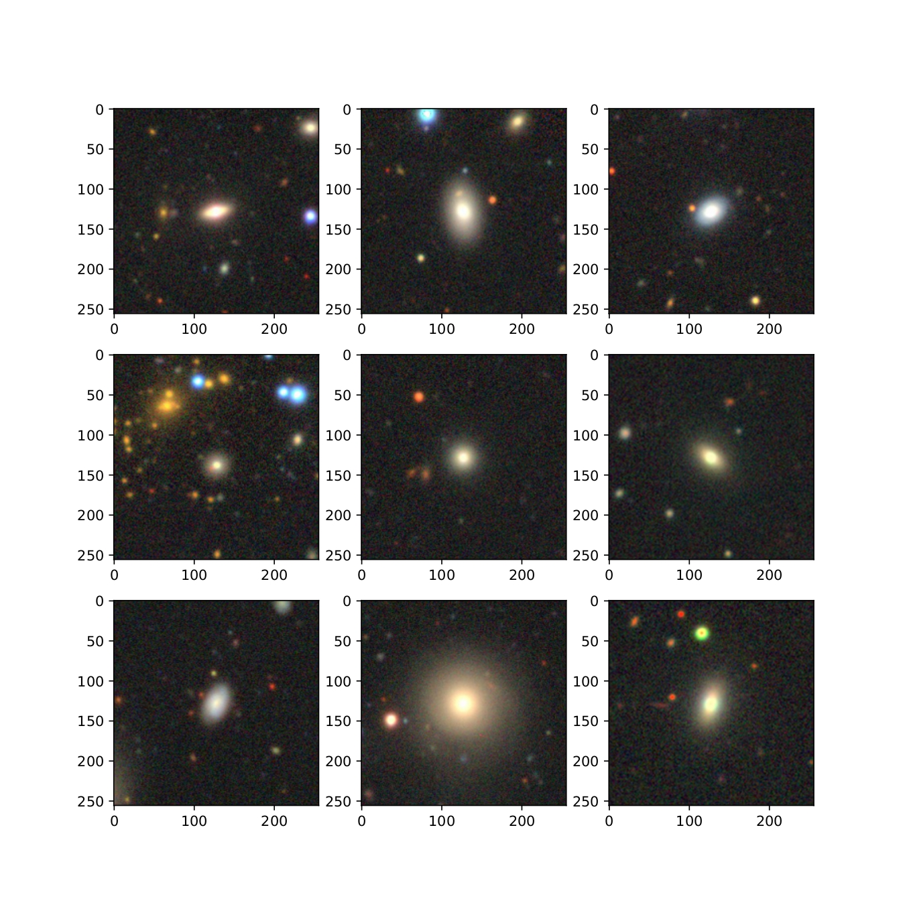 | 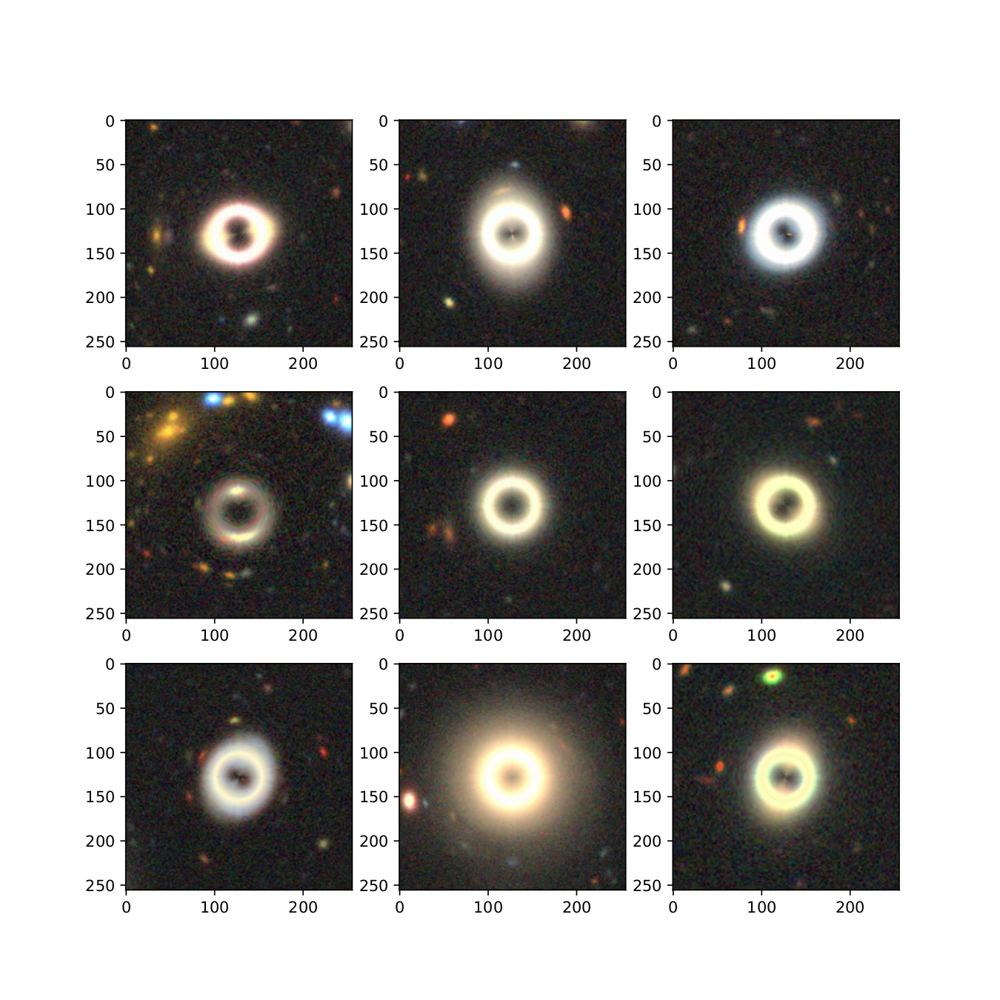  |
| 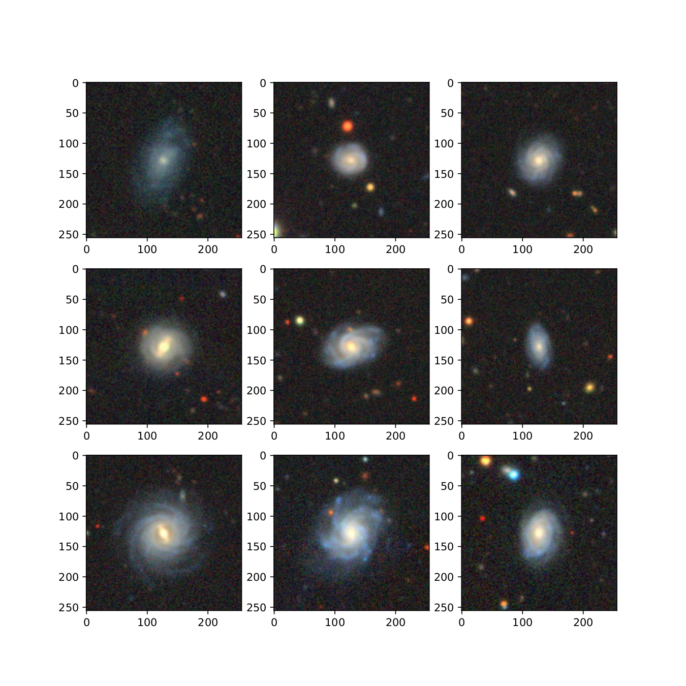 | 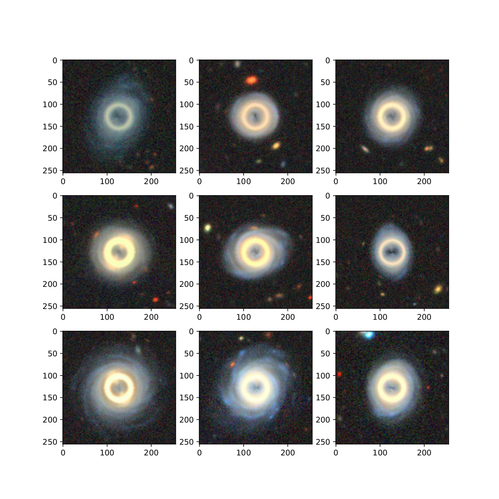  |

While the images produced are very clearly impossible, i.e., the lenses that produced them are not physical, it serves as a demonstration of the method.

**2. Backward with pixel scattering**

We shall now look at are some images of the reverse lensing action. For the reconstruction of the source from the observed images however, no gradients need to be preserved and we are free to use any scattering method we fancy. Following are results with the scatter_add_ function that adds intensities of pixels with the same destination pixel.

| Lensed images | Reconstructed sources |
| --- | --- |
|   | 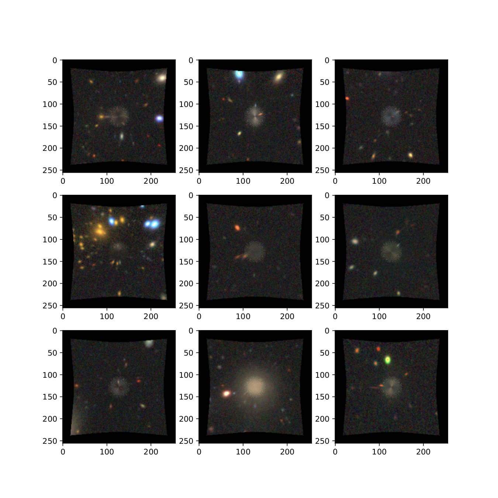 |
|   | 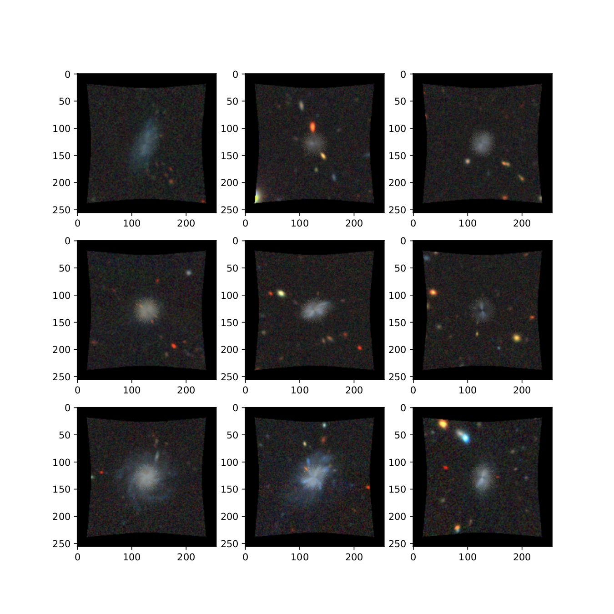 |

These images do not look as nice as the forward modelled images, as in fact, most of the signal is lost in the center to a strange flower shaped artefact. It turns out that the artefact is in fact an interference pattern induced due to rounding off errors during the conversion from the continuous arcsecond space to the discrete pixel space. Since the arcsecond, pixel space is traversed one in either direction, this only adds to the result of too many pixels in the image plane being incorrectly mapped to the same pixels in the source plane (that form the artefact). More information on the artefact in the Appendix.

**3. Backward with grid scattering**

A more nuanced scattering must be practised. Instead of scattering the pixels themselves, one can scatter the points that define a grid in the image space to the source space. This would create a mapping from a square shaped axis aligned grid to an irregular grid. To then prevent (the aphysical) accummulation of intensities in some pixels, the fractional area intersection between the two grids is computed for every grid element to direct the fractional intensities to the destination grid. This is inspired from the work by Vegetti. S. and Koopmans. L. (2018). See Appendix for details on implementation.

The drawback is the initial computation time of the fractional intersection grid, which has the shape `(n_pixels_grid_1, n_pixels_grid_2)`, which for a 256x256 image gives $256^4\approx4.3\cdot10^{9}$ fractional areas to be computed. This is a fairly large number and would take over a couple of days to compute with some optimisations (see Appendix). Luckily, this process can be further optimised, parallelised and the quantity itself can be pre-computed on assuming the **same deflection angle** for all sources.

Here's an example of this working, for a 128x128 pixel grid:
| Lensed images | Reconstructed sources |
| --- | --- |
|   | 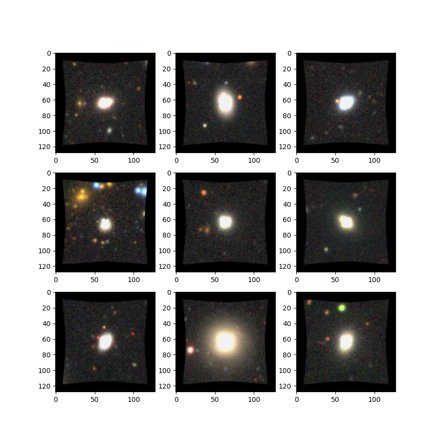 |
|   | 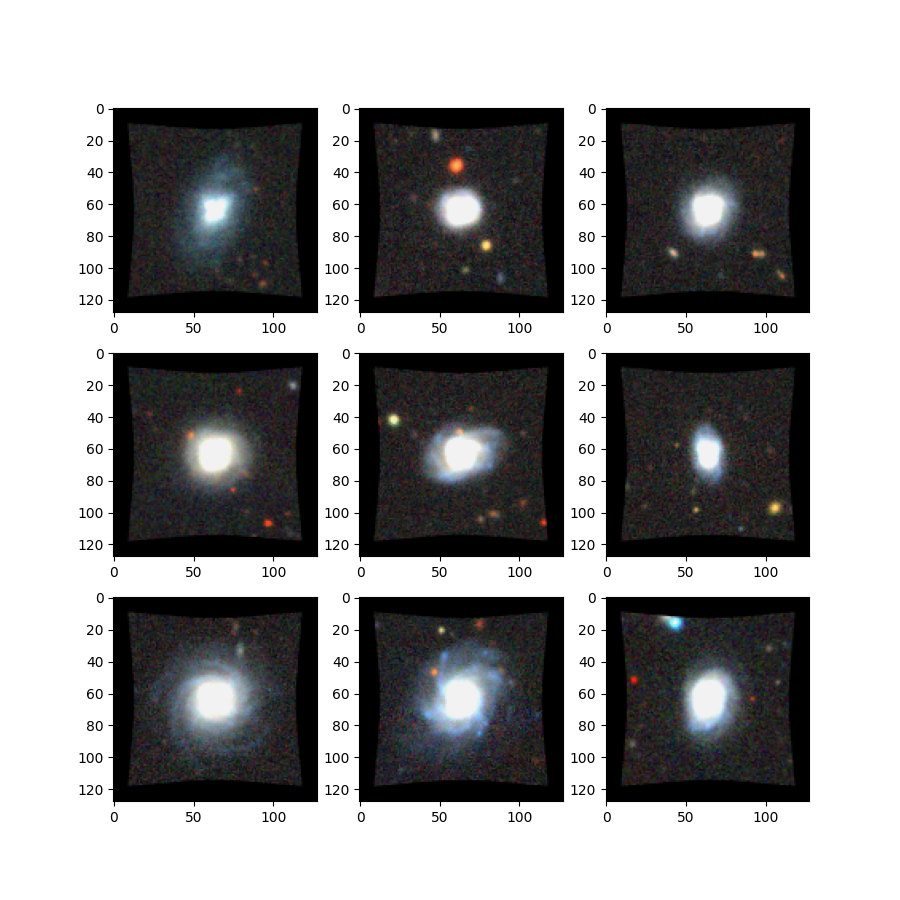 |

We can see that the reconstructions are significantly better. There is only the small problem of overexposure of the central pixels, which will be treated swiftly.

Now that both the 'halves' are working almost as desired, the rest of the project can focus on implementing the method on various images to gather results. They are elaborated below, accompanied by a few extensions.
## 6. Perspectives
1. Evaluate the performance of the source upscaling network on a set of relatively noise-free observed lensed images.
2. Obtain error estimates owing to the model and also the images
3. Limit test with noisy images
4. Study the effects of a lens model with dark matter sub-structure

Extras:
* Optimise and parallelise the intersection grid construction code
* Evaluate performance with more sophisticated networks for source upscaling- GANs, image transformers, etc.

## 7. Appendix

### Sampling from a continuous space

The choice of actions in a typical reinforcement learning environment among a finite set of options. The policy network then learns the best possible probabilities for each of the actions, from which one is sampled during the evolution of the environment. In a continuous environment, the same effects must be achieved but with a infinite choice of actions. The policy network learns thus the mean and standard deviations for each of the actions. The particular action is then sampled from the Gaussian distribution thus constructed. 

This however presents a potentially handle-able difficulty of having to explore an infinitely large search space. It can of course be done in principle within the neighbourhoods of a finite set of points, but will nonetheless take significantly more computation time than its finite counterpart.

Finally, it is not clear whether this approach would necessarily perform better than a finite environment with a very finely resolved set options.

### Artefact isolation

The structure of the artefact can be isolated through scattering of a simple Gaussian at the center of the image. It produces the following image:

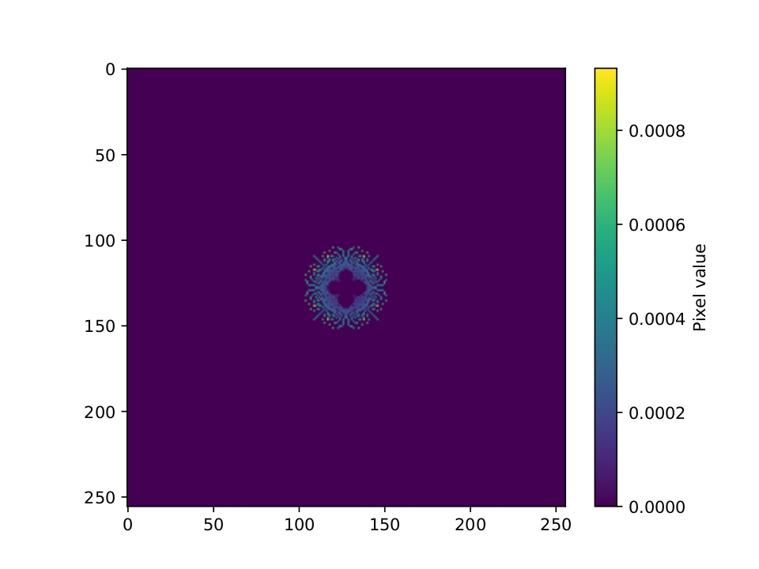

This closely mimics an interference pattern.

### The fractional overlap cross-grid
Instead of scattering pixels in the image space to the source space through the lens equation, we can scatter the grid of pixel vertices, producing a distorted grid. This will allow us to map the intensities in the distorted grid back to an axis oriented square grid by computing the fractional area overlap between each cell of each grid. The square grid can then be directly cast to an image.

Below is an example of the axis oriented grid $\theta$

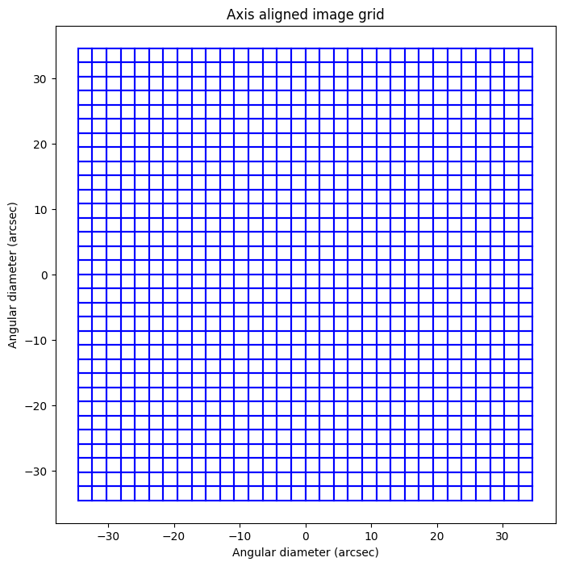

And the source grid $\beta$,

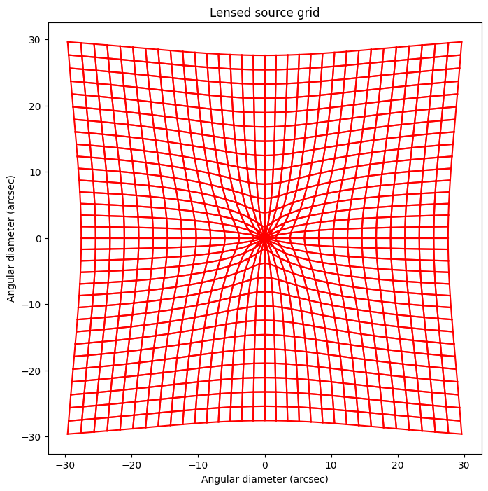

Here's what the overlap looks like:

.

We are no longer obliged to round off arcsecond positions to pixels, but can instead scatter pixel intensities proportional to the fractional area overlap between the the grid cells corresponding to the source pixel and the destination pixel.

Computing area overlap happens in two steps-
1. Crop of the distorted cell by the square cell- through the Sutherland-Hodgman algorithm. 
2. Area computation of the cropped cell- through the Shoelace algorithm

Each cell of the distorted grid must be tested with each cell of the square grid (in the general case). This requires $n^2$ computations but the crop and area calculation can be skipped for cells using a pre-filter that ensures the cells overlap.

### Optimisations for the cross-grid computation

1. Since the intersection of the grid cells is tested sequentially, the entirety of the two grids and the destination grid intersection tensor need not be fetched. Mini-grids will decrease instantaneous memory requirements.
2. Vectorised pre-filter pre-computing to have a g1 x g1 x g2 x g2 shaped mask of where to compute areas- must be divided into mini-grids if g1 and g2 are > 100
3. Sutherland-Hodgman optimisations for square grids-
    a. if quad is above the upper horizontal - skip checking with the rest of the square grid cells
    b. if quad is to the right of the right vertical - skip checking all rows leading up to the square grid cell
    c. if quad is to the left of the left vertical - skip the present row of the square grid cells
4. For simpler deflection fields, a neighbourhood of the source grid can be checked for intersection with the destination grid, as further than that there would be no interactions (e.g., SIS deflection angle)

### Plugging the hole

This is a fairly simple one. Calculation of the deflection angles involved a switch from polar to cartesian coordinates. This carried with it the origin singularity inherent to the radius vector in polar coordinates. A mask that sets the deflection angle to zero exactly in the origin pixel is a quick and physical fix, as along the line-of-sight, there is no lensing.

Here's what the images looked like before this correction:

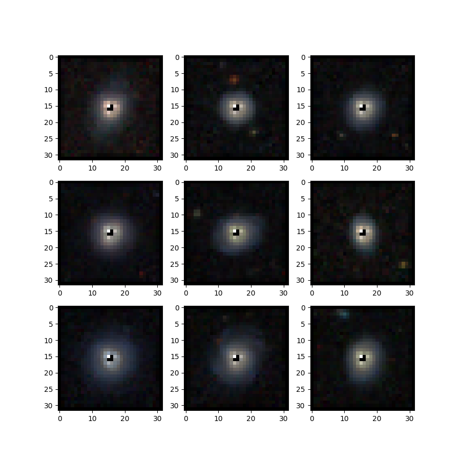