# Updating the DeepLense Pipeline

Strong gravitational lensing is a potential way to learn more about dark matter's basic nature by probing its substructure.
The DeepLense pipeline combines state-of-the-art deep learning models with strong lensing simulations based on lenstronomy. The focus of this project is updating the previous results of DeepLense with new dark matter simulations (Models I, II, III).

 This is a PyTorch-based library for performing Regression, Classification, and Anomaly Detection on the new dark matter simulation models. It is one of the projects under [Google Summer of Code 2022](https://summerofcode.withgoogle.com/). For more info on the project [Click Here](https://summerofcode.withgoogle.com/programs/2022/projects/nZV4B8Xz)
 
 

 I have also written a blog post about my GSoC 2022 experience with this project. Check it out [here](https://medium.com/@saranga.boo/updating-the-deeplense-pipeline-gsoc-2022-with-ml4sci-deb9f20cc928).
<br>

## Datasets
The models are trained on mainly 3 datasets consisting of ~30,000 images (single channel) per class. The test sets contain 5000 images. All the dataset consists of 3 classes : 

- axion (vortex)
- no_sub (No substructure)
- cdm (point mass subhalos)

*Note: The Axion files have an extra datapoint corresponding to mass of axion used in simulation. This mass is used for the Regression task on the axion class of the Models.*

The links to the simulation data are available in the [DeepLenseSim](https://github.com/mwt5345/DeepLenseSim) repo.

### __Model_I__
- 150 x 150 dimensional images
- Modeled with a Gaussian point spread function
- Added background and noise for SNR of around 25

Training data can be found [here](https://drive.google.com/file/d/1QMVLpqag6S9JWqzmGM_pK4C0F1eBVIfV/view?usp=sharing).
Testing data can be found [here](https://drive.google.com/file/d/1rUAKLLS3p9jDaL9R9m84JVKvMcUuVsO1/view?usp=sharing).


### __Model_II__
- 64 x 64 dimensional images
- Modeled after Euclid observation characteristics as done by default in lenstronomy
- Modeled with simple Sersic light profile

Training data can be found [here](https://drive.google.com/file/d/1HYPkdtVUj9xsoGzFDxT4rhl37KmqDCg4/view?usp=sharing).
Testing data can be found [here](https://drive.google.com/file/d/1PFdpqk7XOAKtg0Cnav4HTzyJiudx9dZv/view?usp=sharing).


### __Model_III__
- 64 x 64 dimensional images.
- Modeled after HST observation characteristics as done by default in lenstronomy.
- Modeled with simple Sersic light profile

Training data can be found [here](https://drive.google.com/file/d/1ynKMJoEeKKJqLfuKRR1Y7rQjeBMM0w94/view?usp=sharing).
Testing data can be found [here](https://drive.google.com/file/d/18BuCv40t6qmiNnhjJF1y9rqSBhBOfDon/view?usp=sharing).

<br>

## Setting up the environment

Clone the repository and enter the project folder.

```
git clone https://github.com/ML4SCI/DeepLense.git
cd DeepLense
cd Updating_the_DeepLense_Pipeline__Saranga_K_Mahanta
```

Create a python virtual environment.

```
python -m venv /path/to/new/virtual/environment
```

Activate virtual environment and install the necessary packages from the provided requirements.txt.

```
pip install -r requirements.txt
```

### Model weights

Download all model weights from [here](https://mega.nz/folder/SHZ0CLKQ#gQtyY9Yx9CuwWUEH_pbu8w).

__You're ready!__

## Training/Testing
Details, example jupyter notebooks, and instructions to train/test the Model data of specific tasks can be found in their respective directories.

## Results

### Classification

|  | Model I | Model II | Model III |
|:---:|:---:|:---:|---|
| ROC-AUC plots | 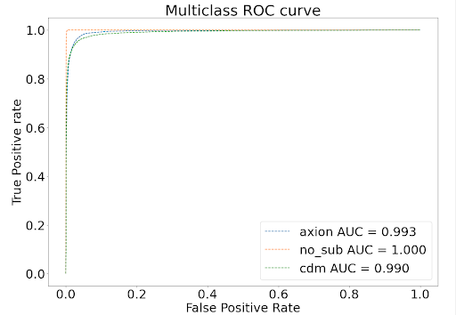 | 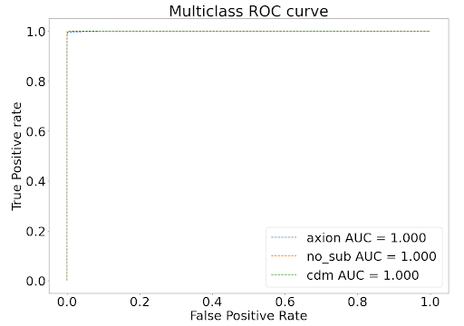 | 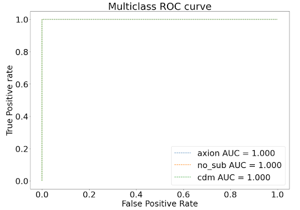 |


### Regression

|  | Model I | Model II | Model III |
|:---:|:---:|:---:|---|
| Predictions vs True Masses scatter plots |  | 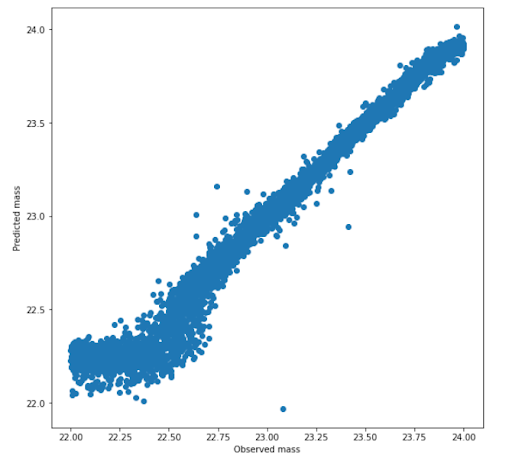 | 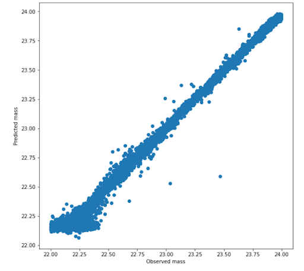 |


### Anomaly Detection

| Network Architecture 	| Model II 	| Model III 	|
|:---:	|:---:	|:---:	|
| Basic Convolutional Autoencoder 	| AUC: 0.96077  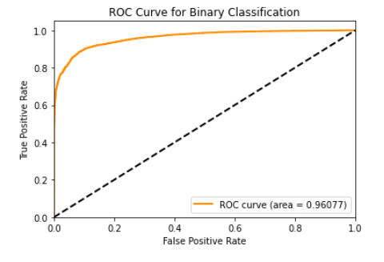 	| AUC: 0.99248  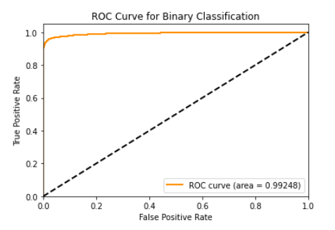	|
| Variational Convolutional Autoencoder 	| AUC: 0.99892  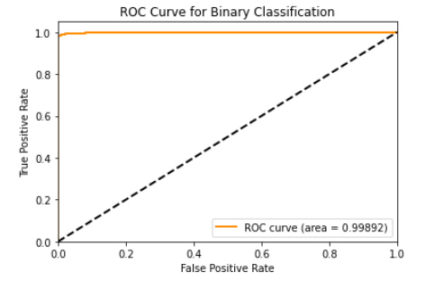	| AUC: 0.99873  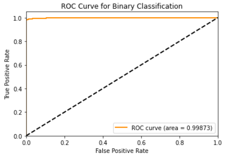	|
| Adversarial Convolutional Autoencoder 	| AUC: 0.99510  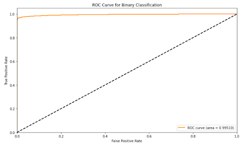	| AUC: 0.99889  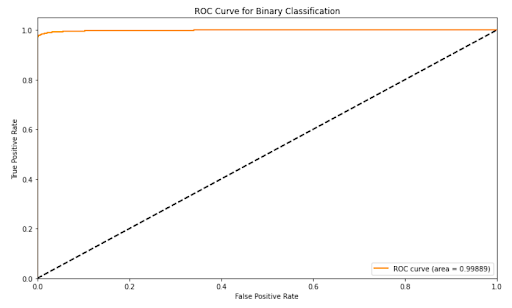	|


## Citations


```bibtex
@article{alexander2020decoding,
  title={Decoding Dark Matter Substructure without Supervision},
  author={Alexander, Stephon and Gleyzer, Sergei and Parul, Hanna and Reddy, Pranath and Toomey, Michael W and Usai, Emanuele and Von Klar, Ryker},
  journal={arXiv preprint arXiv:2008.12731},
  year={2020}
}
```

```bibtex
@article{alexander2020deep,
  title={Deep Learning the Morphology of Dark Matter Substructure},
  author={Alexander, Stephon and Gleyzer, Sergei and McDonough, Evan and Toomey, Michael W and Usai, Emanuele},
  journal={The Astrophysical Journal},
  volume={893},
  number={1},
  pages={15},
  year={2020},
  publisher={IOP Publishing}
}
```

```bibtex
  @misc{rw2019timm,
  author = {Ross Wightman},
  title = {PyTorch Image Models},
  year = {2019},
  publisher = {GitHub},
  journal = {GitHub repository},
  doi = {10.5281/zenodo.4414861},
  howpublished = {\url{https://github.com/rwightman/pytorch-image-models}}
  }
  ```

  ```bibtex
  @misc{Ranger,
  author = {Wright, Less},
  title = {Ranger - a synergistic optimizer.},
  year = {2019},
  publisher = {GitHub},
  journal = {GitHub repository},
  howpublished = {\url{https://github.com/lessw2020/Ranger-Deep-Learning-Optimizer}}
}
```

```bibtex
@inproceedings{woo2018cbam,
  title={Cbam: Convolutional block attention module},
  author={Woo, Sanghyun and Park, Jongchan and Lee, Joon-Young and Kweon, In So},
  booktitle={Proceedings of the European conference on computer vision (ECCV)},
  pages={3--19},
  year={2018}
}
```


